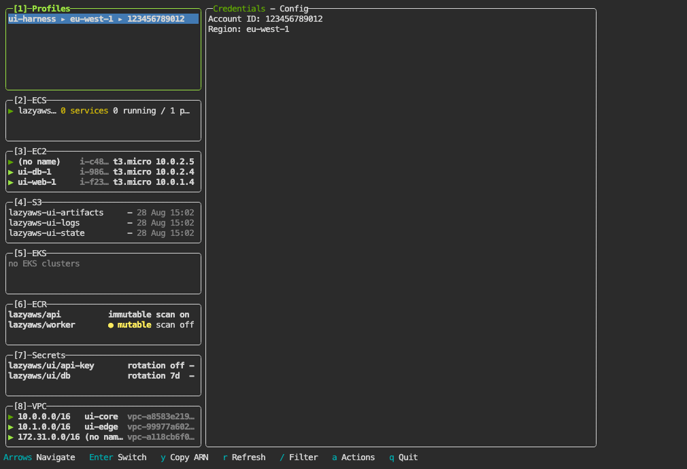

# lazyaws

lazyaws is a keyboard-driven terminal UI for AWS. Browse and operate ECS, EC2, S3, EKS, ECR, Secrets Manager and VPC networking from one dashboard, and ask questions about the account you are looking at in a built-in chat that runs on the AWS Bedrock models your account can already call.

Drill from an ECS cluster to a service to live logs in a few keypresses. Switch profiles, scale a service, reveal a secret, connect to an instance over SSM. No console tabs, no memorizing CLI flags.

> Early development. Expect rough edges, missing services, and breaking changes.

<!-- The checked-in GIF is recorded by test/ui/demo.mjs against the seeded moto harness, so published media cannot disclose an AWS account; regenerate it with `make ui-demo`. -->
<p align="center"></p>

## Navigation in ten seconds

`↑` `↓` or `k` `j` move the cursor. `Tab` and `Shift+Tab`, or `←` `→`, or `h` `l`, move between the eight panels. `Enter` looks into whatever is selected. `,` and `.` change the detail tab on the right. `?` lists every key the panel you are on answers to, and `q` quits.

`,` and `.` are the shipped tab keys because `[` and `]` sit behind AltGr on Spanish, French, German, Italian and Portuguese layouts, where a terminal can deliver them as `Esc` and drill the pane up instead. If your fingers expect something else, switch once and lazyaws remembers it:

```sh
lazyaws --keymap=lazy    # lazydocker's layout: detail tabs back on [ and ]
lazyaws --keymap=vim     # adds Ctrl+F and Ctrl+B paging beside Ctrl+D and Ctrl+U
lazyaws --keymap=emacs   # Ctrl+P, Ctrl+N, Ctrl+B, Ctrl+F to move, Ctrl+V to page, g to refresh
```

The flag writes the choice into `config.yml` and then starts as usual, so it is one run and never again. `--keymap=international` goes back to the shipped layout. `?` lists whichever layout is in force, so the menu follows the switch rather than describing the default forever.

## Quickstart

```sh
brew install noelruault/tap/lazyaws          # macOS and Linux, prebuilt
aws sso login --sso-session <your-session>   # or: aws sso login --profile <profile>
lazyaws
```

`brew upgrade lazyaws` moves you to the next release; the bullet next to the version in the bottom right turns yellow when the build you are running is not the newest tag.

Without Homebrew: `go install github.com/noelruault/lazyaws@latest` builds from source, the [releases page](https://github.com/noelruault/lazyaws/releases) carries archives for macOS, Linux and Windows with their `SHA256SUMS`, and cloning plus `make build` produces `./lazyaws` with the version stamped from `git describe`.

You need:

- AWS credentials in `~/.aws/config`. `AWS_PROFILE` is respected on startup, and profiles can be switched from inside the app.
- For SSO (IAM Identity Center), a valid session: `aws sso login` against the `sso-session` your profiles share covers all of them at once. Setting the file up is [AWS's CLI SSO guide](https://docs.aws.amazon.com/cli/latest/userguide/cli-configure-sso.html); static credential profiles work too and need no login step.
- A region, from `AWS_REGION` or `-region <region>`.

Credentials are checked before the UI starts: an expired SSO session gets one clear message with the exact `aws sso login` line to run, not the same SDK error repeated in every panel. `-version` prints the build version, `-debug` logs to `~/.lazyaws/debug.log`, `-keymap` switches the navigation layout for good. Temporary session credentials are cached in plaintext at `~/.lazyaws/session` (0600) to speed startup; delete the file to clear it, and exclude `~/.lazyaws` from dotfile syncers and backups.

## Why lazyaws

Everyday AWS questions, which tasks are failing, what changed in this deployment, what is in that secret, mean either a chain of console pages or a CLI command whose flags you have to look up. lazyaws keeps the whole account on one screen, a keypress away, with guardrails: read-only mode hides every mutating action, and the chat is off until you turn it on.

## Features

- ECS drill-down: clusters to services to tasks, with a live-tailing CloudWatch Logs tab and detail tabs for deployments, events, scaling and task definitions.
- Actions on every resource: scale or redeploy a service, exec into a task, stop it, connect to an EC2 instance over SSM, reveal a secret.
- A command bar: `:ecs:my-cluster:my-service` goes straight there, `:scrts` fuzzy-matches when nothing else does, and every keystroke previews what Enter will do.
- Chat about the account you are browsing, on your own credentials: the default `bedrock` backend is a plain AWS call to models the account can already invoke, and the optional `kiro` backend shells out to the Kiro CLI. Off by default.
- Read-only mode: one switch makes lazyaws a viewer. Nothing that starts, stops, deletes, rotates or edits is offered, and shells are refused.
- A settings screen: `o` lists switches, toggles write straight into `config.yml`, and your comments and unmanaged keys survive the write.
- Profile switching with preflight: profiles from `~/.aws/config`, one Enter to switch, and every tab reloads for the new account.

## Services

- Accounts: caller identity (account ID, region) and the profile list; `Enter` switches the active profile.
- ECS: clusters, services and tasks as a stacked drill-down, with per-level actions and a live CloudWatch Logs tab.
- EC2: instances with state and public or private IP; `c` connects over SSM.
- S3: buckets, presigned URLs, and a version list.
- EKS: clusters with status and node count.
- ECR: repositories, with a lifecycle-policy dry run.
- Secrets Manager: metadata, rotation, replication and versions; the value stays masked until revealed with `v`, the one action read-only mode keeps.
- VPC: every VPC with its CIDRs and DNS settings, and a tab each for subnets (marked public or private by the route table that governs them, not by the auto-assign flag), route tables, internet and NAT gateways, endpoints, and transit gateway attachments. On the Endpoints tab the rows carry a cursor: `Enter` opens the full record (policy, DNS names, security groups, subnets), `Esc` returns to the list. Read-only, because every mutation here silently breaks traffic that is already flowing.

## Keybindings

| Key | Action |
| --- | --- |
| `1` to `8` | Jump to a panel (`1` Profiles, `2` ECS, `3` EC2, `4` S3, `5` EKS, `6` ECR, `7` Secrets, `8` VPC) |
| `Tab` / `Shift+Tab`, `←` / `→`, `h` / `l` | Next or previous panel. In the main panel the arrows scroll it horizontally, and `Tab` moves between detail tabs |
| `↑` / `↓`, `k` / `j` | Move the cursor in the focused view |
| `Enter` | Look into the selection: ECS drills into the cluster or service, Profiles switches profile, every other list opens it in the main panel |
| `Esc` | Back to the panel column, or up one ECS drill level. Never quits |
| `,` / `.` | Previous or next detail tab, from a list as well as from the main panel. Set `keybindingPreset: lazy` for lazydocker's `[` and `]` instead |
| `Home` / `End` | Jump to the top, or follow the bottom, of the main panel |
| Mouse | Click to focus, click a detail tab header to switch tabs, wheel to scroll |
| `Ctrl+C` | Quit |

The bottom line carries one hint, `? Keys`. Press `?` (or `x`) for every binding the focused view answers to, arrows and vim keys listed together, and the path of the file that rebinds them.

### Rebindable keys

Generated from `DefaultKeys` in `ui/keymap.go`: each config name, default chord, binding, options label, help-menu entry and documentation row comes from that table. `make keys` regenerates this table, and `make test` fails when it is stale.

<!-- BEGIN GENERATED KEYS -->
| Name | Default | Action |
| --- | --- | --- |
| `nav-up` | `k` | Move up in the focused view |
| `nav-down` | `j` | Move down in the focused view |
| `nav-left` | `h` | Move left in the focused view |
| `nav-right` | `l` | Move right in the focused view |
| `scroll-main-up` | `ctrl+u` | Scroll the main panel up |
| `scroll-main-down` | `ctrl+d` | Scroll the main panel down |
| `scroll-main-page-up` | `PgUp` | Scroll the main panel up |
| `scroll-main-page-down` | `PgDn` | Scroll the main panel down |
| `command-bar` | `:` | Go to a resource by name, or run a command |
| `actions` | `a` | Open the actions menu for the focused item (every panel, and the main panel) |
| `filter` | `/` | Filter the focused list |
| `copy-id` | `y` | Show the selected item's full id / ARN, untruncated, to copy by hand (every panel, and the main panel) |
| `refresh-panel` | `r` | Refresh the focused panel |
| `refresh-all` | `R` | Refresh everything |
| `prev-tab` | `,` | Previous detail tab |
| `next-tab` | `.` | Next detail tab |
| `screen-mode-next` | `+` | Next screen-size mode (normal / half / full main) |
| `screen-mode-prev` | `_` | Previous screen-size mode |
| `options-menu` | `x` | Show the keybindings for the current view |
| `help` | `?` | Show the keybindings for the current view |
| `settings` | `o` | Open the Settings screen |
| `amazon-q` | `A` | Switch to the chat screen, when enabled |
| `quit` | `q` | Quit |
| `redraw` | `ctrl+l` | Repaint every cell, if the terminal was scrolled and the display is torn |
| `ecs-exec` | `e` | Exec into the selected task's container (ECS) |
| `ec2-connect` | `c` | Connect to the instance over SSM (EC2) |
| `secrets-reveal` | `v` | Reveal / mask the secret value (Secrets) |
| `secrets-toggle-deleted` | `d` | Toggle showing deleted secrets (Secrets) |
| `settings-edit-file` | `e` | Open the config file in $EDITOR (Settings) |
| `chat-pick-model` | `ctrl+p` | Choose the model (chat) |
| `chat-new-conversation` | `ctrl+n` | Start a fresh conversation (chat) |
| `chat-toggle-folds` | `ctrl+f` | Fold / unfold every code block (chat) |
<!-- END GENERATED KEYS -->

Any named chord can be rebound from `config.yml` without a rebuild:

```yaml
keybindings:
  actions: m
  amazon-q: a
  nav-down: n
  nav-up: p
```

### Navigation presets

A preset moves a handful of those keys at once, so a whole layout is one line instead of a dozen rebinds. Name none and you get `international`, which is the layout the table above already prints.

`lazyaws --keymap=<name>` is the same thing from the command line: it validates the name, writes it here and carries on starting. The file is the source of truth either way.

```yaml
keybindingPreset: emacs   # emacs | international | lazy | vim
keybindings:
  filter: Ctrl+S          # a hand written key still wins over the preset
```

<!-- BEGIN GENERATED PRESETS -->
| Preset | Moves |
| --- | --- |
| `emacs` | `chat-new-conversation` to `Ctrl+T`, `chat-pick-model` to `Ctrl+O`, `nav-down` to `Ctrl+N`, `nav-left` to `Ctrl+B`, `nav-right` to `Ctrl+F`, `nav-up` to `Ctrl+P`, `refresh-all` to `G`, `refresh-panel` to `g`, `scroll-main-page-down` to `Ctrl+V` |
| `international` | nothing, this is the table above |
| `lazy` | `next-tab` to `]`, `prev-tab` to `[` |
| `vim` | `chat-toggle-folds` to `Ctrl+K`, `scroll-main-page-down` to `Ctrl+F`, `scroll-main-page-up` to `Ctrl+B` |
<!-- END GENERATED PRESETS -->

Each preset lists only what it changes; every other key stays as the table above prints it. Both layers are validated at startup, so a preset that does not exist, or a chord that cannot be parsed, is reported as a startup problem rather than silently leaving you without the key.

What each one is for:

- `international`: the layout the table above prints, so it moves nothing. Detail tabs are on `,` and `.`, which are unshifted everywhere. It is what you get without naming a preset, because on Spanish, French, German, Italian and Portuguese layouts the brackets sit behind AltGr, and a terminal sending Option as Meta delivers them as `Esc` plus a character, so the pane would drill up instead of changing tab.
- `lazy`: lazydocker's own layout, where this UI came from. It puts detail tabs back on `[` and `]`; everything else already matches.
- `vim`: the shipped keys are already vim's, since lazydocker borrowed `hjkl`, `/` and `:` from it. What was missing is the full page pair, `Ctrl+F` and `Ctrl+B`, next to the half page `Ctrl+D` and `Ctrl+U` that were already there. The chat's fold key gives up `Ctrl+F` and takes `Ctrl+K`.
- `emacs`: cursor movement on `Ctrl+P`, `Ctrl+N`, `Ctrl+B`, `Ctrl+F`, paging on `Ctrl+V`, and `g` to refresh, which is what magit and dired trained most emacs users on. The chat's model picker and new conversation move off `Ctrl+P` and `Ctrl+N` so the cursor can have them. `M-v` and `M-x` are absent because gocui parses `Alt` only with a named key, not with a letter, and isearch's `Ctrl+S` is absent because terminals still use it for flow control; set it by hand if you have turned that off.

Adding one is a map entry in `ui/keymap.go` and nothing else: the docs table, the Settings row and the tests all read `KeyPresets`, so a new layout is validated, listed and documented without touching any of them.

A preset applies at startup, so changing it from the Settings screen takes effect the next time lazyaws runs.

### The command bar

`:` opens an input at the bottom of the screen. Type where you want to go and press Enter:

| You type | Where it goes |
| --- | --- |
| `:ecr` | the ECR panel |
| `:aws:ec2:instances` | the same panel, spelled out in full |
| `:ec2:web-server-1` | EC2, cursor on that instance |
| `:profiles:staging` | switches to that profile |
| `:ecs:my-cluster:my-service` | ECS, drilled to that service's tasks |
| `:scrts` | Secrets, because it fuzzy-matches when nothing else does |
| `:vpc` | the VPC panel |
| `:filter prod` | the `/` filter on the focused panel, needle already typed |

Every keystroke previews what Enter would do; `Tab` completes as far as the candidates agree; `Esc` backs out. `:help` and `:quit` are there too.

## Benchmark

| Metric | Value | Baseline | Captured |
| --- | --- | --- | --- |
| Cold start, `lazyaws -version` | 20.3 ms ± 3.6 ms | none yet | 2026-08-12, macOS, hyperfine with 3 warmups |
| Binary size, `make build` | 26 MB | none yet | 2026-08-12 |

## Configuration

lazyaws reads an optional YAML file, all keys optional. The path comes from the OS's own user-config location:

| | path |
| --- | --- |
| macOS | `~/Library/Application Support/lazyaws/config.yml` |
| Linux | `~/.config/lazyaws/config.yml` |
| any, if `$XDG_CONFIG_HOME` is set | `$XDG_CONFIG_HOME/lazyaws/config.yml` |

```yaml
gui:
  scrollHeight: 2
  sidePanelWidth: 0.333
  screenMode: normal      # normal|half|fullscreen
  border: rounded          # rounded|single|double|hidden
  theme:
    activeBorderColor: [green, bold]
    selectedLineBgColor: [blue]
confirmOnQuit: false
refresh:
  ecsLogsSeconds: 5
  ec2StatusSeconds: 10
  overviewSeconds: 2                        # the Overview tab's auto-refresh; 0 turns it off
  panelSeconds: 2                           # the focused panel's list reload; 0 turns it off
  metricsSeconds: 60                        # CloudWatch metrics, billed per metric requested; 0 turns it off, and anything under 10 is treated as 10
chat:
  enabled: false                            # the chat screen, off unless you ask for it
  provider: bedrock                         # bedrock|kiro
  model: anthropic.claude-sonnet-4-6        # bedrock only; any model id the account can call
readOnly: false                             # hide every action that changes AWS state
```

You don't have to write any of this by hand: `o` opens the Settings screen, toggles write straight into the file (keeping your comments and any keys they don't manage), and `o` then `e` opens it in `$EDITOR` for the keys the screen doesn't cover (theme, panel widths, keybindings). The refresh intervals cycle through a ladder of values on the screen; the file takes any number.

### Read-only mode

`readOnly: true` (or the Settings switch) makes lazyaws a viewer. The actions menus keep only what reads; SSM shells and ECS exec are refused, because a shell can change anything; the `kiro` chat backend is refused too, since `--trust-all-tools` lets it run AWS commands. Browsing, filtering, logs, presigned URLs and secret reveal all still work.

### Chat

Off by default, because either backend answers with your own AWS credentials. Turn it on in Settings, then `A` swaps the dashboard for the chat screen: conversations on the left, the answer streaming on the right, markdown rendered, long code blocks folded.

**`bedrock` (default).** An ordinary signed AWS call on the profile you are browsing: nothing to install, no second login, spend on the AWS bill you already have. The model list is whatever Bedrock reports the account can call, and newer Anthropic ids are resolved to the region's inference profile automatically. Cost is per question, not per month: at roughly 2,400 input and 400 output tokens, `anthropic.claude-sonnet-4-6` is about $0.013 a question and `amazon.nova-micro-v1:0` about $0.00014.

**`kiro`.** Shells out to the [Kiro CLI](https://kiro.dev/docs/cli/) (the Amazon Q Developer CLI's current name), which must be installed and signed in. It brings its own AWS tooling and runs commands with your credentials via `--trust-all-tools`, so read it as an agent, not a chat. Its free tier may use content for service improvement; paid tiers via IAM Identity Center do not.

The current profile, region and account ID go with every question, so "which instances are running?" is about the account you are looking at. Chats live as long as the session.

## Development and contributing

Run `make` for the target list. `make dev` runs the TUI from source, `make lint test` is what CI enforces, and `make prepare-release` runs the whole gate (lint, dependency and license checks, `go mod tidy -diff`, build, race-enabled tests, release binary). `make release` produces a current-platform archive with the binary and every project, adapted-source and dependency license notice required for redistribution. `make setup` points git at `.githooks` so the gate also runs on pre-push.

Cutting a release: `make release-all` builds the five archives and `dist/SHA256SUMS`, all six get uploaded to the tag, and then `make brew-formula VERSION=vX.Y.Z` writes `dist/lazyaws.rb` with the hashes read back out of the published `SHA256SUMS`, which is the file that lands in [noelruault/homebrew-tap](https://github.com/noelruault/homebrew-tap) as `Formula/lazyaws.rb`. Nobody types a hash by hand, and a formula generated from a local `dist/` agrees with one generated from the release.

There is no CONTRIBUTING.md yet; issues and small PRs are welcome. The navigation registry is cloud-agnostic and `ui/providers/aws/register.go` is the single AWS-aware seam, so a new service panel, or a second cloud as a sibling package, is the cheapest substantial contribution.

## License and credits

lazyaws's original code is MIT-licensed; see [LICENSE](LICENSE). Identified third-party portions remain under their upstream licenses.

UI design and architecture ported from [lazydocker](https://github.com/jesseduffield/lazydocker) by Jesse Duffield, MIT licensed. The fuzzy matcher adapts [fzf](https://github.com/junegunn/fzf) by Junegunn Choi, MIT licensed, and parts of the confirmation-panel flow derive from [gocui](https://github.com/jroimartin/gocui), BSD-3-Clause licensed. Copyright notices and complete applicable license texts are in [ACKNOWLEDGMENTS.md](ACKNOWLEDGMENTS.md) and [LICENSES](LICENSES/).

### Replacing borrowed code

When a dependency or a borrowed component is dropped, it is not paraphrased. The existing implementation is treated as a black box: feed it inputs, record what comes back, and write down the contract that behaviour implies. The replacement is then written against that contract, and the two are diffed across a corpus of inputs until the only lines they still share are ones that could not be written differently — the function signature, a closing brace, a return the contract dictates. Observing what code does is not copying how it says it.

That is how `ui/layout` came to exist. It replaced a third-party layout engine and matches it exactly on all 336 layouts this application can produce, while fixing a panic the original hit when no child claimed a weight and clamping fixed panels that could previously draw past their parent. It shares no implementation with what it replaced, so it carries no attribution. The chat's line wrapper and the AWS context preamble were rebuilt the same way.

The method has a boundary worth stating plainly. Not everything here was rebuilt that way: the TUI foundation and the `ui/fuzzy` matcher build on upstream work, used under MIT with the copyright notices retained in [ACKNOWLEDGMENTS.md](ACKNOWLEDGMENTS.md) and [LICENSES](LICENSES/) and credited above. Nothing here is presented as original that isn't.

lazyaws is an independent project and is not affiliated with, sponsored by, or endorsed by Amazon Web Services. Amazon Web Services, AWS, Amazon Q, Amazon Bedrock, and Kiro are trademarks of Amazon.com, Inc. or its affiliates.

The historical `v0.1.0` module archive remains available under MPL-2.0. This source tree and releases from `v0.2.0` onward are licensed as described above; release tags must not reuse `v0.1.0`.
